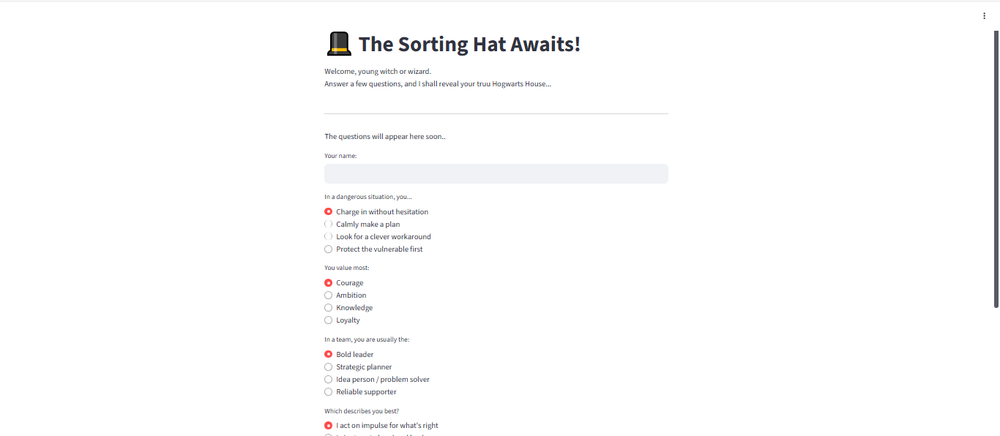
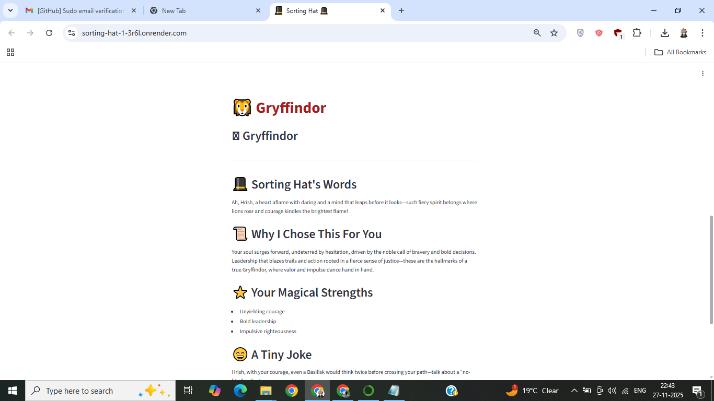
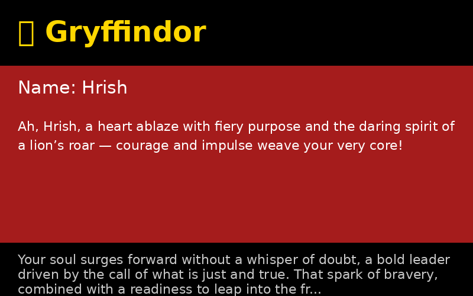

# 🎩 Sorting Hat — Which Hogwarts House Are You?

A cinematic GenAI Streamlit app that sorts users into a Hogwarts house using a theatrical Sorting Hat persona (OpenAI GPT). The app returns a dramatic Sorting Hat line, a short reasoning, three strengths, a Patronus suggestion, and a downloadable House Card.

---

## Features
- Cinematic Sorting Hat persona (prompt-engineered)
- 5-question personality mini-quiz
- House reveal with themed emoji and color
- House Card (PNG) generation and download
- Confetti/balloons on reveal and playful UI
- Secure API key handling via `.env`

---
## 🚀 Live Demo

Try the live Sorting Hat app here:  
👉 **https://sorting-hat-1-3r6l.onrender.com**

## 📸 Screenshots

### 🏠 Home Screen

### 🎩 Sorting Hat Reveal

### 🃏 Downloadable House Card

